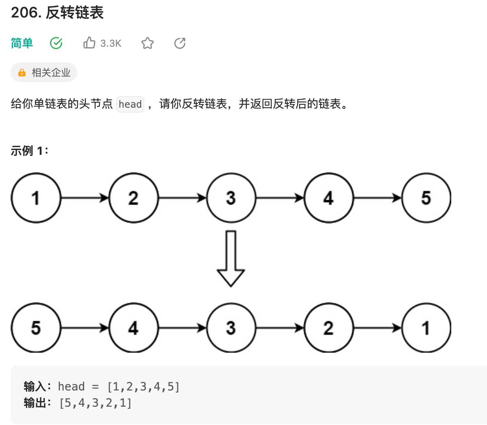
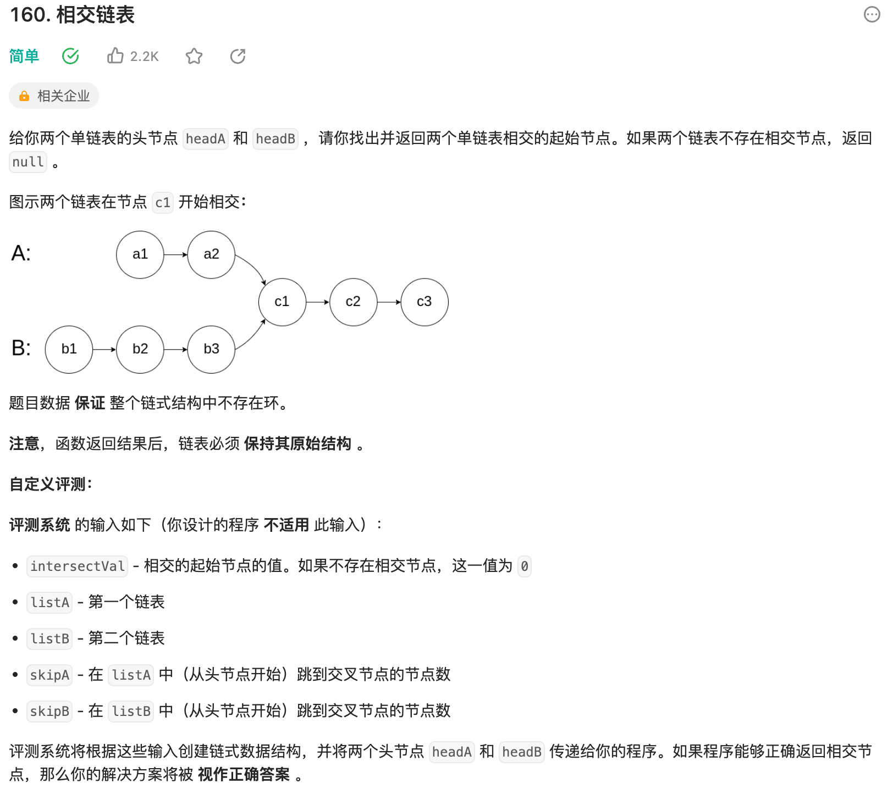
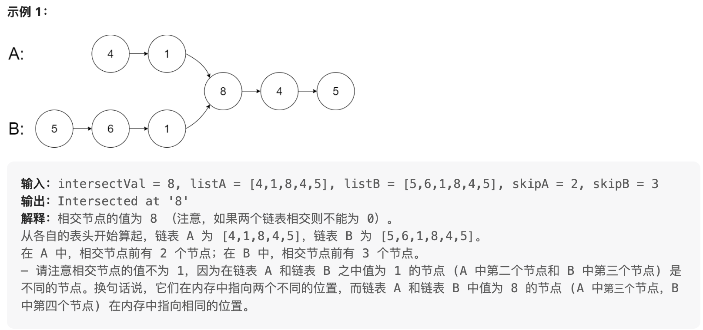
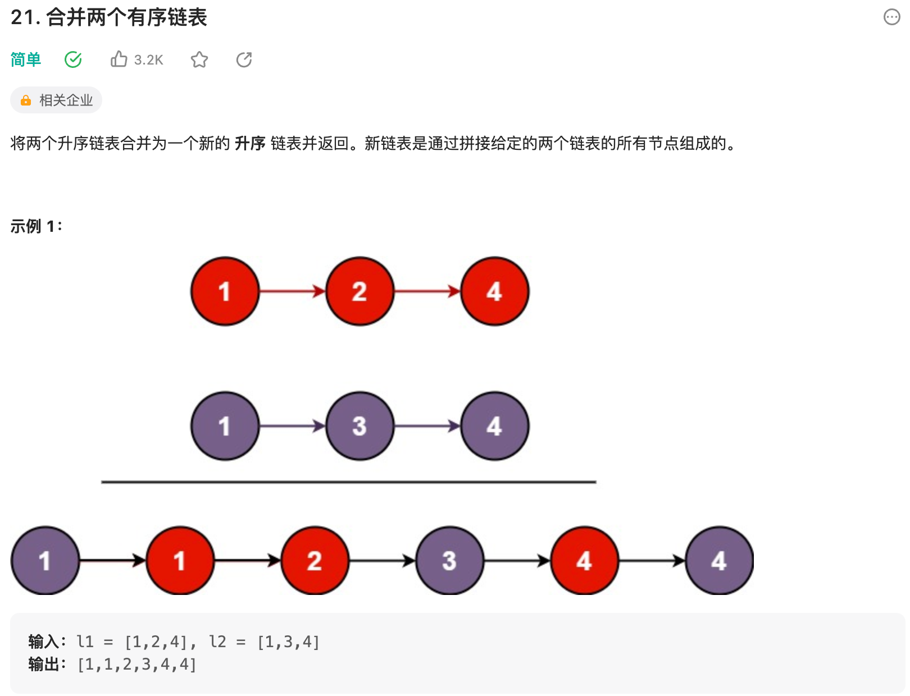
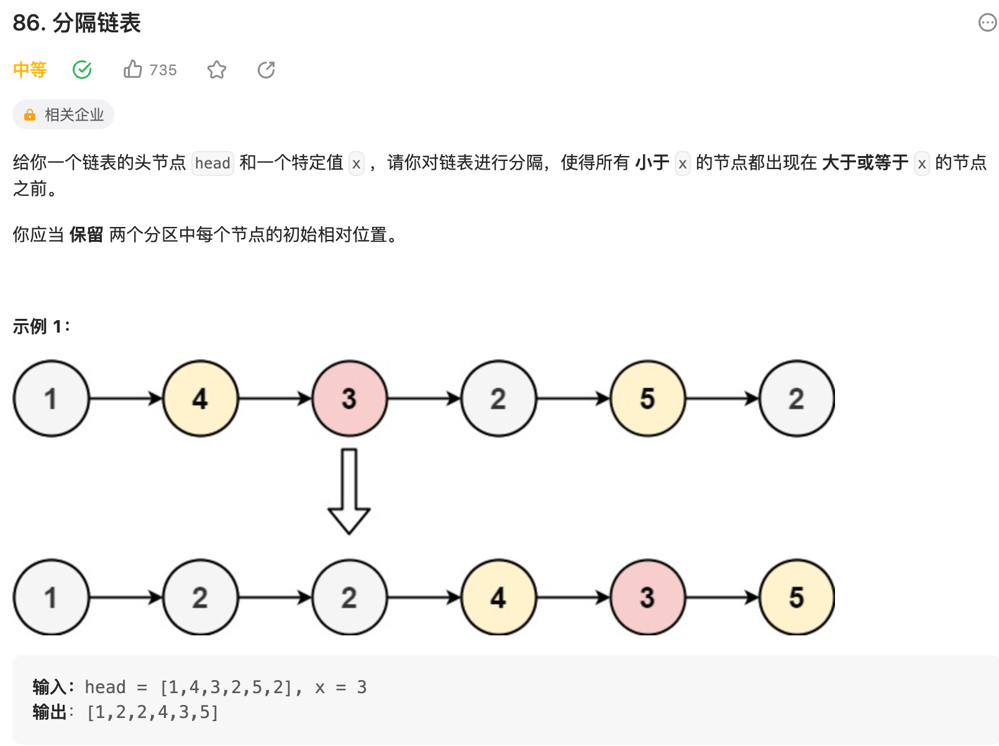
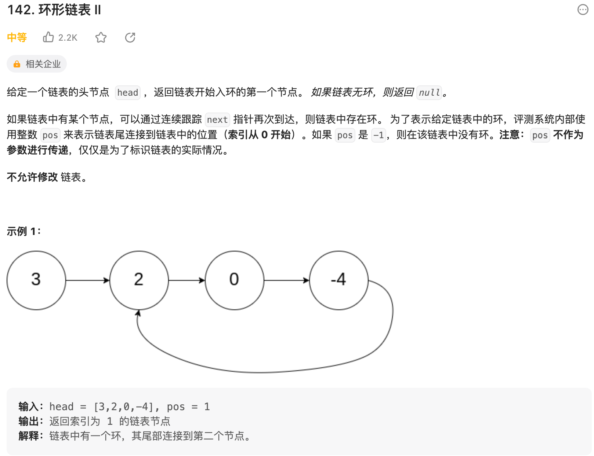
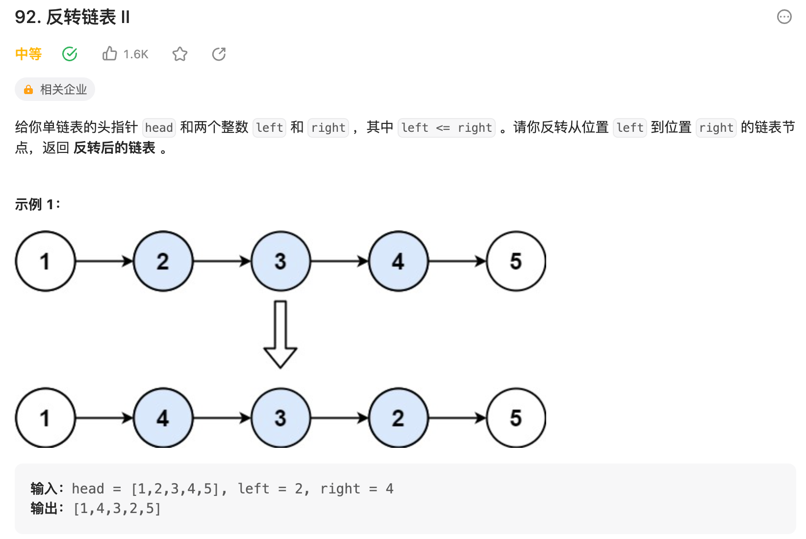
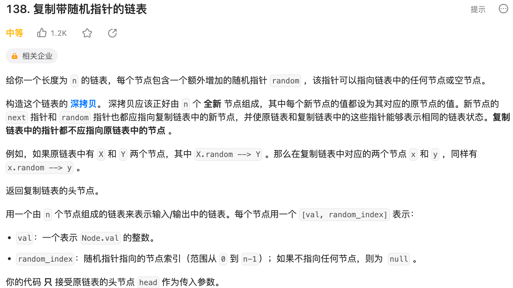
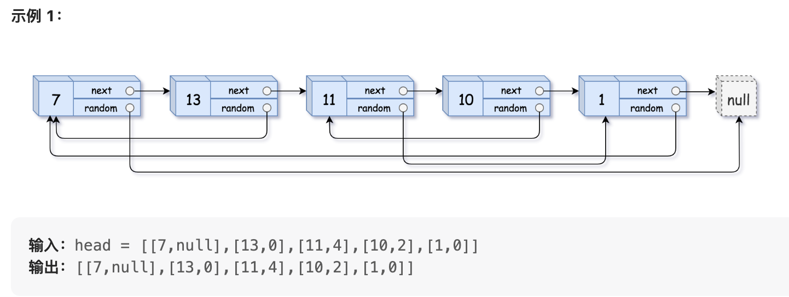

# 题目描述

<!--目录-->
#### [Week1. 链表、栈、队列](#week1-e993bee8a1a8e6a088e9989fe58897-1)
#### [Week2. 递归、排序、贪心](#week2-e98092e5bd92e68e92e5ba8fe8b4aae5bf83-1)
#### [Week3. 搜索算法、回溯算法、位运算、二分查找](#week3-e6909ce7b4a2e7ae97e6b395e59b9ee6baafe7ae97e6b395e4bd8de8bf90e7ae97e4ba8ce58886e69fa5e689be-1)
#### [Week4. 二叉树](#week4-e4ba8ce58f89e6a091-1)
#### [Week5. 动态规划、背包问题](#week5-e58aa8e68081e8a784e58892e8838ce58c85e997aee9a298-1)
#### [Week6. 剑指Offer](#week6-e58991e68c87offer-1)

<!--Week1-->
## Week1. 链表、栈、队列
### 1、链表基础知识
### 2、[反转链表（ LeetCode 206 ）](https://leetcode.cn/problems/reverse-linked-list/)

### 3、[相交链表（ LeetCode 160 ）](https://leetcode.cn/problems/intersection-of-two-linked-lists/)

### 4、[合并两个有序链表 （ LeetCode 21 ）](https://leetcode.cn/problems/merge-two-sorted-lists/)

### 5、[分隔链表 （ LeetCode 86 ）](https://leetcode.cn/problems/partition-list/)

### 6、[环形链表 II （ LeetCode 142 ）](https://leetcode.cn/problems/linked-list-cycle-ii/)

### 7、[反转链表 II （ LeetCode 92 ）](https://leetcode.cn/problems/reverse-linked-list-ii/)

### 8、[复制带随机指针的链表（ LeetCode 138 ）](https://leetcode.cn/problems/copy-list-with-random-pointer/)

### 9、堆栈基础知识
### 10、[有效的括号（ LeetCode 20 ）](https://link.zhihu.com/?target=https%3A//www.algomooc.com/610.html)
### 11、[基本计算器（ LeetCode 224 ）](https://link.zhihu.com/?target=https%3A//www.algomooc.com/1102.html)
### 12、[最小栈（ LeetCode 155 ）](https://link.zhihu.com/?target=https%3A//www.algomooc.com/608.html)

<!--Week2-->
## Week2. 递归、排序、贪心
<!--Week3-->
## Week3. 搜索算法、回溯算法、位运算、二分查找
<!--Week4-->
## Week4. 二叉树
<!--Week5-->
## Week5. 动态规划、背包问题
<!--Week6-->
## Week6. 剑指Offer